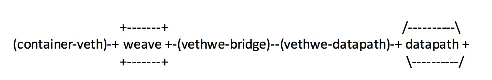

# Pod Networking in KoV (Kubernetes on Vsphere)

This document describes how we use Weave Net to provide:

   * pod networking
   * support of Kubernetes network policies

## Set up Weave Net via addon
  After we have a Kubernetes cluster up (with --network-plugin=cni), at the master node we run :

  `kubectl apply -f weave-net.yaml`

  * It sets up Weave Net on each worker node
  * On each worker node, a pod for Weave Net is created in kube-system namespace
  * There are two containers for each Weave pod:
    
    * weave-kube
      
        * Installs Weave CNI plugin on the host
        * Sets Weave up on this host
        * Looks for Weave peers
        
    * weave-npc 
        
        * It is the Kubernetes network policy controller
        * Listens to Kubernetes network policy events and translates them to iptable rules
        
  * When a new worker node joins:
    * `kubectl get nodes` shows the new worker node is ready after a few seconds
    * Weave Networking is set up automatically for the new worker node

      We can quickly check this by ping from older workers to the new one via weave interfaces.
    * Network policies already set also take effect on the new worker node

## How Weave Net provides pod networking

  In their own words:

  
  
  "weave" is a Linux bridge and "datapath" is an Open vSwitch datapath; they are connected via a veth pair. Packet capture and injection use the "datapath" device, via "router/fastdp.go:fastDatapathBridge"
 
  We can use `ovs-dpctl show` to verify ovs datapath setup. We see three ports are created on datapath:
  

	port 0: datapath (internal)  
	port 1: vethwe-datapath  
	port 2: vxlan-6784 (vxlan)  
  

  port `vethwe-datapath`  connects to `datapath` on one side and to port `vethwe-bridge` on the other side. (`vethwe-bridge` is connected to `weave bridge`).
  port `vxlan-6784` is the vxlan port that connects `datapath` to the ethernet interface.
 